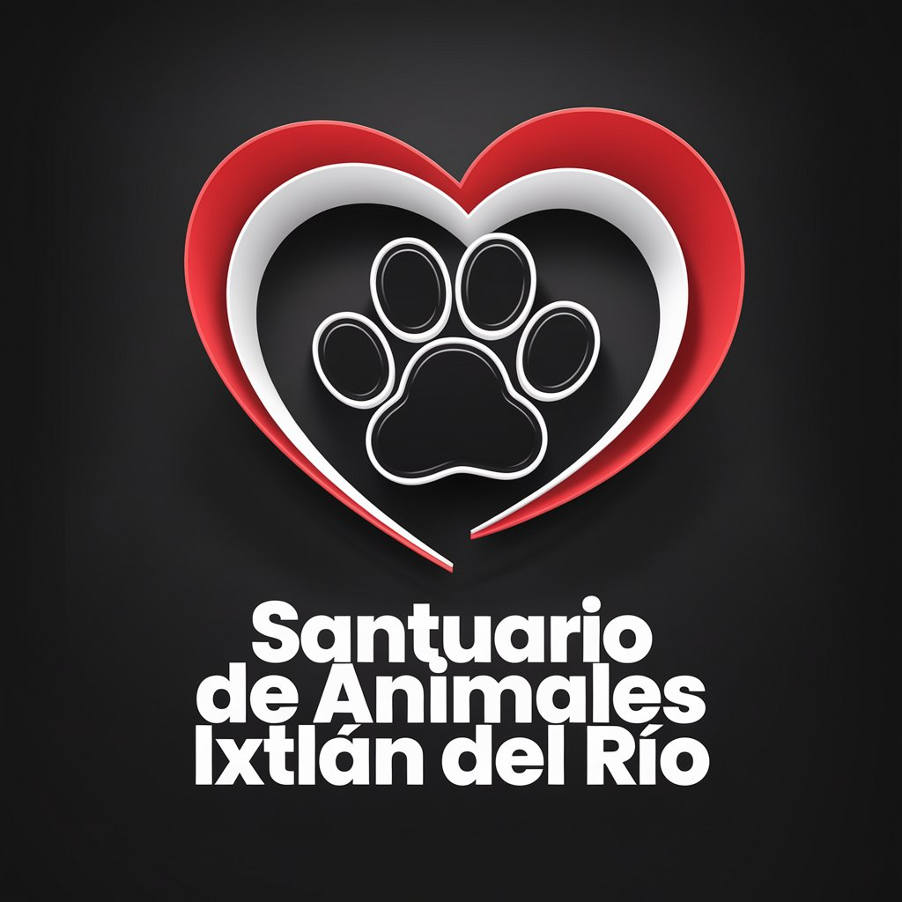

 
  # FERNANDO BERUMEN --->  INTELLIGENT SYSTEMS ENGINEER
  # 🦅 DAEMON TECH | ARQUITECH SOFTWARE AUTOMATION & WEB3 
 

  ### **"NOT HUMAN. NOT AI. ONLY ONE."**
  
  

    
    
  

  ---

  ### 📂 DECLASSIFIED SYSTEMS PROTOCOL
  
  > *"Durante la última década, mi arquitectura operó dentro de **servidores locales aislados** y repositorios privados bajo NDA. 
  > **System Update [2025]:** Security protocol adjusted. Ahora estoy abriendo el código fuente de herramientas internas seleccionadas para demostrar capacidades avanzadas en ingeniería de datos, síntesis de IA e infraestructura Web3."*

  ---

## 🛠️ THE ARSENAL (Tech Stack)

### 🧠 ARTIFICIAL SYNTHETICS & AI

### 📊 DATA INTELLIGENCE & ANALYTICS

### 🔗 WEB3 & OFFENSIVE SECURITY

---

## 🚀 FEATURED ARCHITECTURE

| PROJECT | CLASSIFICATION | TECH SPECS |
| :--- | :--- | :--- |
| **[XIREN v8.0](https://github.com/ferdinandmileto/xiren-voice-core)** | 🗣️ **Neural Voice Core** | Asistente de IA Híbrido con síntesis de voz humana y cerebro local (LLM). |
| **[FINAL BOSS](https://github.com/ferdinandmileto/solana-rpc-infrastructure)** | 💎 **High-Frequency Algo** | Detección de liquidez en tiempo real sobre Solana RPC Nodes. |
| **[RETAIL INTELLIGENCE](https://github.com/ferdinandmileto/retail-intelligence)** | 📊 **ETL & Data Engine** | Pipeline de transformación de datos masivos y visualización en Power BI. |

---

  
  
  
   
   
  ---

   
  
  
  ## ❤️ LA OTRA CARA DEL INGENIERO
  *(The Human Side)*

> "Han pasado casi 10 años desde que inicié una labor social que, más que eso, es una luz de esperanza para seres que para la mayoría no valen nada o ni siquiera existen. Olvidados, marginados en las sombras... **decidí entregarles mi luz para darles una esperanza de vida.**
>
> Lejos del código, librerías, dashboards o APIs, existe otra entidad con experiencia en **salvar vidas, responsabilidad, sacrificio, gestión de ayuda, atención y amor incondicional.**"

  *"Esta es la experiencia que pongo por delante, la que quiero que hable por mí. Una experiencia opuesta a lo empresarial: no genera ROI, jamás se llega a ser 'Senior', pero es **AUTÉNTICA**. No se compra, no se logra académicamente, pero sobre todo... **PERMANECE EN EL ALMA ETERNAMENTE.**"*

   
  
  

 
  *“Automation is not about replacing humans. It’s about elevating them.”*
   
  **Fernando Gutiérrez Berumen** | Intelligent Systems Engineer

